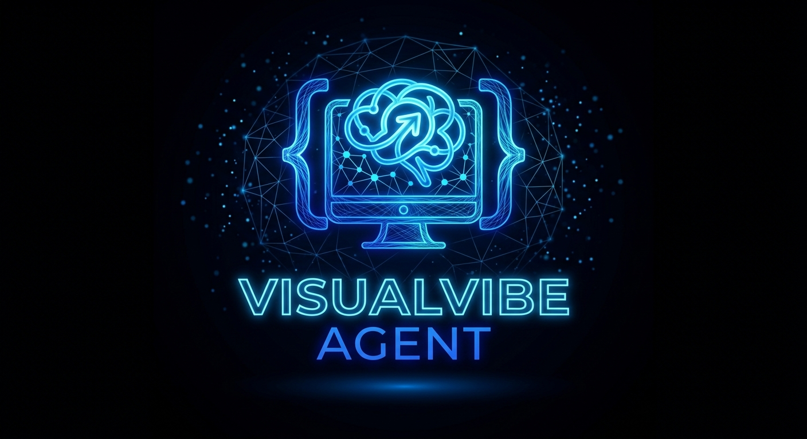

<p align="center">
  
</p>

# 🧠 VisualVibe Agent

VisualVibe Agent is a containerized, web-native development environment running on **AlmaLinux 10**. It delivers a high-performance desktop experience directly in the browser via **KasmVNC** (port 8080), featuring **Visual Studio Code** equipped with the **Cline AI agent** extension, paired with **FileBrowser Quantum** (port 8081) for file management.

---

## 🚀 Key Features

- **Base Operating System**: Enterprise-grade **AlmaLinux 10** with optimized package dependencies.
- **Web Desktop**: HTML5 / WebSocket streaming via **KasmVNC 1.5.0** (Fedora 43 RPM compatible with EL10) on port `8080`.
  - Dynamic display auto-fitting up to 4K UHD.
  - Custom VisualVibe Agent branding, favicon, splash screen, and responsive sidebar.
  - Borderless, maximized IDE presentation powered by Openbox.
- **Visual Studio Code & Cline**:
  - Official Microsoft VS Code RPM pre-configured with custom title and styling.
  - **Cline AI extension** (`saoudrizwan.claude-dev`) pre-installed.
  - Agnostic AI backend connectivity dynamically configurable via environment variables (`AI_API_URL`, `AI_API_KEY`).
  - Terminal Execution Mode pre-configured to **Background Exec** for reliable non-blocking command execution.
  - Editor mode pre-configured with **Background Edit** enabled to allow edits without stealing editor focus.
- **Web File Management**: **FileBrowser Quantum** on port `8081` (`/filebrowser/`) with one-click sidebar transition.
- **Rootless Podman-in-Podman**: Nested container capabilities inside the development container (`/dev/fuse` + `fuse-overlayfs`).
- **Zero Startup Updates**: Immutable, build-time compilation for instant startup and total reproducibility.
- **User Environment**: Dedicated non-root user `vvagent` (UID 1000) with persistent storage at `/home/vvagent`.

---

## 📁 Project Structure

```
VisualVibe Agent/
├── Containerfile                  # AlmaLinux 10 build recipe
├── entrypoint.sh                  # Container initialization & runtime orchestration
├── .containerignore               # Podman build context ignore rules
├── run_env.sh                     # Quick local execution script
├── deploy.sh                      # Automated Systemd Quadlet deployment script
├── config/
│   ├── kasmvnc.yaml               # KasmVNC display and network settings
│   ├── filebrowser.yaml           # FileBrowser Quantum configuration
│   ├── openbox-rc.xml             # Openbox window rules (maximized borderless VS Code)
│   └── containers-storage.conf    # Nested Podman storage driver settings
├── media/
│   ├── visualvibe_icon.png        # Official high-contrast square logo & icon
│   ├── visualvibe_horizontal.png  # High-contrast horizontal banner (sidebar logo)
│   ├── visualvibe_biglogo.jpg     # Full VisualVibe Agent neon banner (README header)
│   ├── favicon.ico                # Multi-layer Windows / browser tab favicon
│   └── favicon_*.png              # Multi-resolution favicons (16x16 to 192x192)
├── scripts/
│   ├── print_banner.sh            # Neon ASCII art startup banner
│   ├── brand_kasmvnc.py           # KasmVNC web UI asset & theme patcher
│   ├── open-browser               # Launch or focus Chromium inside the desktop
│   └── openbox-autostart          # Resilient VS Code supervisor loop
├── quadlet/
│   ├── visualvibe-agent.container # Rootless Quadlet container unit
│   └── visualvibe-home.volume     # Rootless persistent volume unit
```

---

## ⚙️ Configuration & Environment Variables

| Variable | Required | Default | Description |
|---|---|---|---|
| `AI_API_URL` | **Yes** | — | Base URL for the external AI API endpoint (OpenAI-compatible, e.g. OmniRoute) |
| `AI_API_KEY` | **Yes** | — | API key for authenticating against the AI endpoint |
| `AI_LANG` | **Yes** | — | Sets Cline's native **Preferred Language** via ISO code (e.g. `it`, `en`, `es`). See [Supported AI Languages](#-supported-ai-languages). |
| `VISUALVIBE_PORT` | No | `8080` | Host port for the KasmVNC Web Desktop |
| `VISUALVIBE_FB_PORT` | No | `8081` | Host port for FileBrowser Quantum |
| `VISUALVIBE_CONTAINER`| No | `visualvibe-agent` | Name of the running container instance |
| `VISUALVIBE_VOLUME` | No | `visualvibe-home` | Podman persistent volume name |

> ⚠️ **Mandatory Variables:** The container strictly validates `AI_LANG`, `AI_API_KEY`, and `AI_API_URL` on startup. If any of these variables are unset or empty, the container will immediately abort execution with a fatal error indicating which variables are missing.


### 🌐 Supported AI Languages (`AI_LANG`)

The `AI_LANG` environment variable configures Cline's native **Preferred Language** (found in *Settings ⚙️ → General Settings*). You can supply standard ISO 639-1 language codes:

| `AI_LANG` Code | Language in Cline |
|---|---|
| `en` | English *(default)* |
| `it` | Italian - Italiano |
| `es` | Spanish - Español |
| `fr` | French - Français |
| `de` | German - Deutsch |
| `pt` | Portuguese - Português |
| `zh` | Simplified Chinese - 简体中文 |
| `ja` | Japanese - 日本語 |
| `ko` | Korean - 한국어 |
| `ru` | Russian - Русский |
| `ar` | Arabic - العربية |
| `hi` | Hindi - हिन्दी |
| `tr` | Turkish - Türkçe |
| `nl` | Dutch - Nederlands |
| `pl` | Polish - Polski |

> *Note: `AI_LANG` is required (e.g. `en`, `it`, `es`). Any exact label or unmapped string passed to `AI_LANG` will be passed directly to Cline's configuration.*


### Cline AI Model Routing

Cline is pre-configured with **"Use different models for Plan and Act modes"** enabled.
The following OmniRoute combo names are hardcoded at boot:

| Mode | OmniRoute Combo ID | Purpose |
|---|---|---|
| **Plan** | `visualvibe-plan` | Deep reasoning, architectural planning, strategy |
| **Act** | `visualvibe-act` | Fast execution, tool-calling, code writing, refactoring |

These combo names are sent as the `model` field in the OpenAI-compatible API request.
OmniRoute resolves them to the actual provider/model based on its combo configuration (e.g. primary → Antigravity Pool, fallback → Oneprovider).

---

## 💻 Quick Start (Local Run)

### Building the Image
To build the container image directly with Podman:
```bash
sudo podman build -t visualvibe-agent .
```

To display the ASCII art banner every time regardless of layer cache:
```bash
sudo podman build --build-arg BANNER_CACHEBUST=$(date +%s) -t visualvibe-agent .
```

### Running Locally
To launch the full local environment:
```bash
# Optional: define your AI endpoint before running
export AI_API_URL="https://api.your-ai-service.com/v1"
export AI_API_KEY="your-secret-api-key"

./run_env.sh

# Skip image rebuild (use existing image — faster for restarts):
./run_env.sh --no-build
```

Access the interfaces in your browser:
- **Web Desktop**: [http://localhost:8080/](http://localhost:8080/)
- **File Manager**: [http://localhost:8081/filebrowser/](http://localhost:8081/filebrowser/)

---

## 🚢 Production Deployment (Quadlet Systemd)

VisualVibe Agent is fully integrated with **Podman Quadlets** for native, rootless systemd service management.

```bash
# Deploy to local user systemd
./deploy.sh --local

# Deploy to remote server over SSH
./deploy.sh user@server.domain.com --port 8080 --fb-port 8081
```

### Managing the Service

```bash
# Check service status
systemctl --user status visualvibe-agent.service

# Restart service
systemctl --user restart visualvibe-agent.service

# View real-time service logs
journalctl --user -u visualvibe-agent.service -f

# View container logs
podman logs -f visualvibe-agent
```

---

## 🛡️ Security & Reverse Proxy Configuration

### Internal Ports

VisualVibe Agent exposes **two HTTP services** without built-in authentication:

| Service | Container Port | Protocol | Description |
|---|---|---|---|
| **VisualVibe Agent** (KasmVNC) | `8080` | HTTP + WebSocket | Web desktop (HTML5/WebSocket streaming) |
| **VisualVibe FileBrowser** | `8081` | HTTP | Web file manager (upload/download) |

> [!IMPORTANT]
> Both services run **unauthenticated** by design. Authentication must be enforced at the perimeter via a reverse proxy with SSO/SAML/OAuth2.

### Reverse Proxy Routing

Configure your load balancer or reverse proxy to expose a single HTTPS domain:

| Public URL | Backend Target | Notes |
|---|---|---|
| `https://<DOMAIN>/` | `http://<CONTAINER_IP>:8080/` | KasmVNC desktop — requires WebSocket upgrade |
| `https://<DOMAIN>/filebrowser/` | `http://<CONTAINER_IP>:8081/filebrowser/` | FileBrowser Quantum — standard HTTP |

#### WebSocket Requirements (KasmVNC)

KasmVNC uses WebSocket for the VNC stream. Your reverse proxy **must** support WebSocket upgrades on the root path `/`. Example headers to set:

```
Upgrade: $http_upgrade
Connection: "upgrade"
```

#### Nginx Example

```nginx
server {
    listen 443 ssl;
    server_name vvagent.example.com;

    # SSO/SAML authentication (e.g. via Vouch, oauth2-proxy, or SAML SP module)
    # auth_request /validate;

    # VisualVibe Agent (KasmVNC) — WebSocket required
    location / {
        proxy_pass http://127.0.0.1:8080;
        proxy_http_version 1.1;
        proxy_set_header Upgrade $http_upgrade;
        proxy_set_header Connection "upgrade";
        proxy_set_header Host $host;
        proxy_set_header X-Real-IP $remote_addr;
        proxy_read_timeout 86400s;
        proxy_send_timeout 86400s;
    }

    # VisualVibe FileBrowser
    location /filebrowser/ {
        proxy_pass http://127.0.0.1:8081/filebrowser/;
        proxy_set_header Host $host;
        proxy_set_header X-Real-IP $remote_addr;
        client_max_body_size 10G;  # Allow large file uploads
    }
}
```

#### Cloudflare Zero Trust Example

If using **Cloudflare Access** as the SSO layer:

1. Create an **Access Application** for `vvagent.example.com` with your IdP (SAML, OIDC, GitHub, etc.)
2. Create a **Cloudflare Tunnel** pointing to `http://localhost:8080` for the root path
3. Add a second **public hostname rule**: `vvagent.example.com/filebrowser/*` → `http://localhost:8081`
4. Cloudflare handles TLS termination, SSO enforcement, and WebSocket proxying natively

### Security Model

- **Perimeter Security**: All access control (SSO/SAML/OAuth2/mTLS) is enforced at the reverse proxy layer. Container services are deliberately unauthenticated to avoid double-login friction.
- **Least Privilege**: The inner environment runs under UID `1000` (`vvagent`). Nested rootless Podman isolates containers run inside the development environment.
- **VS Code Restart Opt-out**: To prevent VS Code from auto-restarting (e.g., to use the desktop without it), create the file `/tmp/.vscode_no_restart` inside the container.
